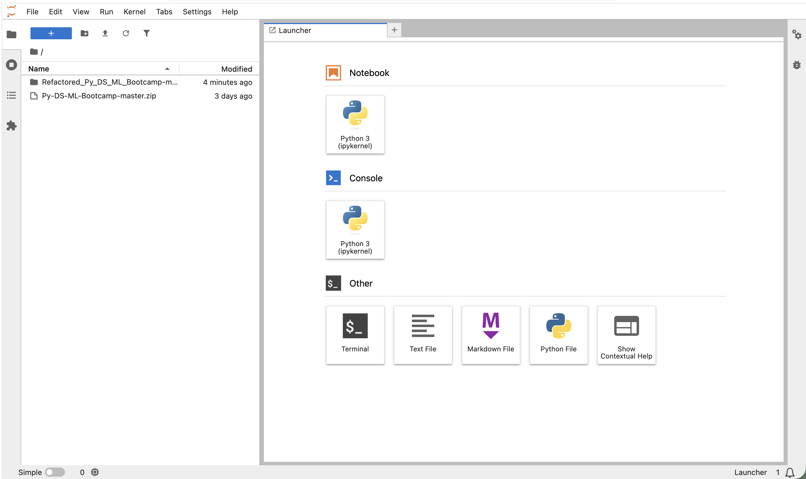
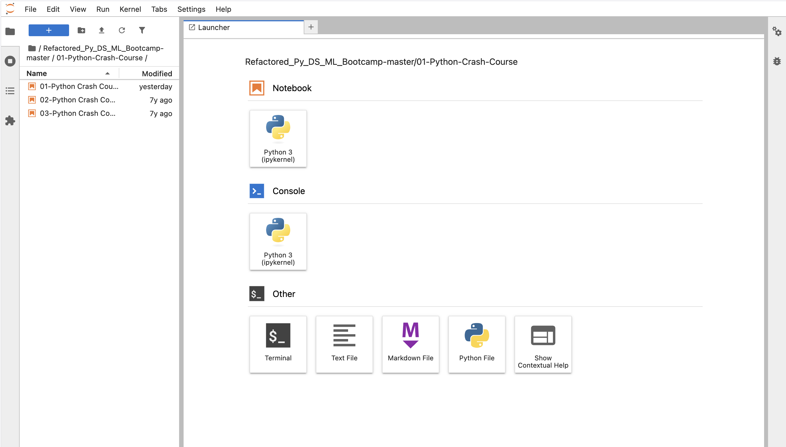
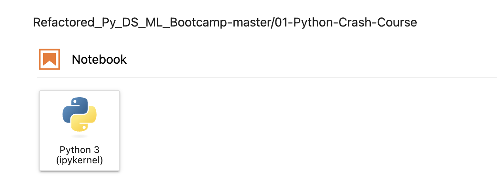
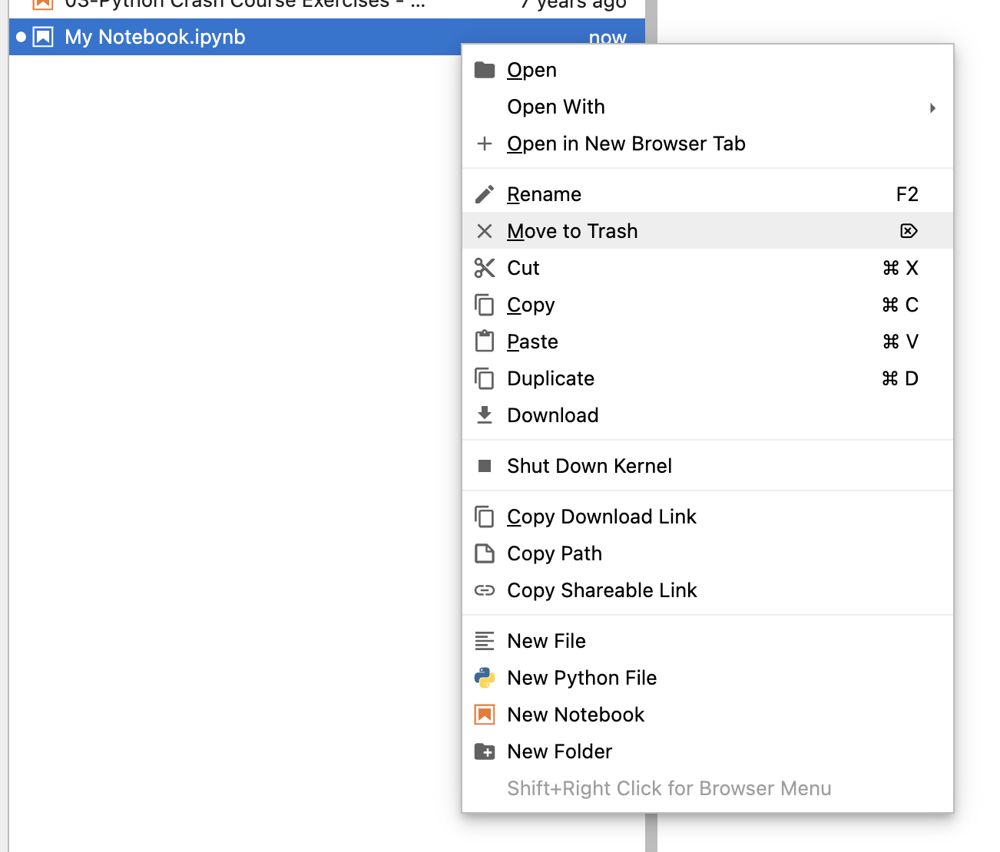
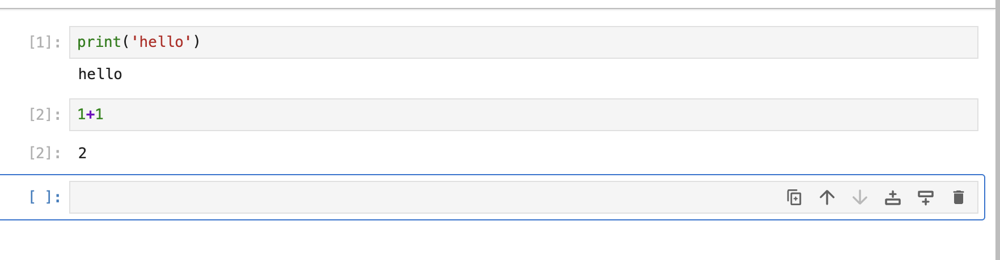

# Jupyter Notebooks
First go over how to open a Jupyter notebook
- Go to Terminal and run `jupyter lab` in the directory with your Jupyter Notebooks after following the steps listed on `04 - Python Environment Setup.md` for **How to run Juypter when installed Miniforge via Homebrew**.

When you run `jupyter lab`, you web browser will show a Jupyter window with the files in the directory.

Will start on `01 - Python Crash Course` folder

If you want to make a new Juypter file in that directory you can click the `+` and click `Python 3` under the Notebook section:

If you want to rename, right click on the `.ipynb` on the project finder on the right, and find and click on `Rename`.

Below is called a `cell`. You can put Python code in there and then click the run button to execute that cell.

Or you can click `Shift + Enter` whne you have selected cell to run a cell.

If you click `Option + Enter`, that is a shortcut that puts a cell below another cell.

---

